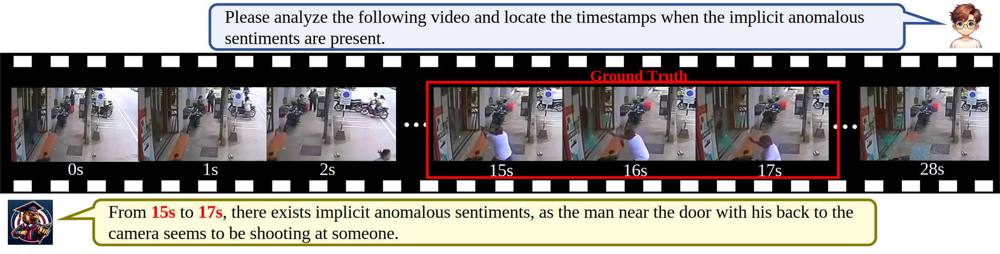

<h2 align="center"> <a href="https://openreview.net/pdf?id=ys3V4jiENk">Hawkeye: Discovering and Grounding Implicit Anomalous Sentiment in Recon-videos via Scene-enhanced Video Large Language Model</a></h2>
<h5 align="center"> If you like our project, please give us a star ⭐ on GitHub for latest update.  </h2>

This repository contains the official implementation of our work in ACM MM 2024. More details can be viewed in our paper. [[PDF]](https://openreview.net/pdf?id=ys3V4jiENk)

## Abstract

In real-world recon-videos such as surveillance and drone reconnaissance videos, commonly used explicit language, acoustic and facial expressions information is often missing. However, these videos are always rich in anomalous sentiments (e.g., criminal tendencies), which urgently requires the implicit scene information (e.g., actions and object relations) to fast and precisely identify these anomalous sentiments. Motivated by this, this paper proposes a new chat-paradigm Implicit anomalous sentiment Discovering and grounding (IasDig) task, aiming to interactively, fast discovering and grounding anomalous sentiments in recon-videos via leveraging the implicit scene information (i.e., actions and object relations). Furthermore, this paper believes that this IasDig task faces two key challenges, i.e., scene modeling and scene balancing. To this end, this paper proposes a new Scene-enhanced Video Large Language Model named Hawkeye, i.e., acting like a raptor (e.g., a Hawk) to discover and locate prey, for the IasDig task. Specifically, this approach designs a graph-structured scene modeling module and a balanced heterogeneous MoE module to address the above two challenges, respectively. Extensive experimental results on our constructed scene-sparsity and scene-density IasDig datasets demonstrate the great advantage of Hawkeye to IasDig over the advanced Video-LLM baselines, especially on the metric of false negative rates. This justifies the importance of the scene information for identifying implicit anomalous sentiments and the impressive practicality of Hawkeye for real-world applications.

## Dependencies

You can set up the environments by using `conda env create -f environment.yml`.